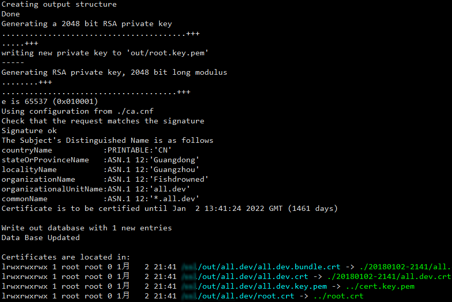

# 自签泛域名证书
此工具用于颁发泛域名证书，方便开发环境调试。

请勿用于生产环境，生产环境还是购买正式的证书。  
或者到 [Let's Encrypt](https://letsencrypt.org/) 可以申请到免费证书  
（没有泛域名，但是可以指定多域名）。

## 优点
1. 你可以创建任意网站证书，只需导入一次根证书，无需多次导入；
1. 减少重复又无谓的组织信息输入，创建证书时只需要输入域名；
1. 泛域名证书可以减少 `nginx` 配置，例如你要模拟 CDN：  
假设你的项目网站是 `example.dev`，CDN 网站设置为 `cdn.example.dev`，  
你只需在 `nginx` 里面配置一个网站，`server_name` 同时填写  `example.dev`  
和 `cdn.example.dev`，它们可以使用同一个 `*.example.dev` 的证书。
1. 现在你只需要一个证书，就可以搞定所有项目网站！

我当时怎么没想到可以这样用 `SAN`：
```ini
subjectAltName=DNS:*.one.dev,DNS:one.dev,DNS:*.two.dev,DNS:two.dev,DNS:*.three.dev,DNS:three.dev,DNS:*.four.dev,DNS:four.dev
```

## 系统要求
1. Linux，openssl
1. 事先用 `hosts` 或者 `dnsmasq` 解析你本地开发的域名，  
例如把 `example.dev` 指向 `127.0.0.1`

## 使用
```bash
./gen.cert.sh <domain> [<domain2>] [<domain3>] [<domain4>] ...
```
把 `<domain>` 替换成你的域名，例如 `example.dev`

运行的输出像这样：



如果有多个项目网站，可以把所有网站都加上去，用空格隔开。

生成的证书位于：
```text
out/<domain>/<date>-<time>/<domain>.crt
out/<domain>/<date>-<time>/<domain>.bundle.crt
```

证书有效期是 4 年，你可以修改 `ca.cnf` 来修改这个年限。

根证书位于：  
`out/root.crt`  
成功之后，把根证书导入到操作系统里面，信任这个证书。

根证书的有效期是 10 年，你可以修改 `gen.root.sh` 来修改这个年限。

证书私钥位于：  
`out/cert.key.pem`

其中 `<domain>.bundle.crt` 是已经拼接好 CA 的证书，可以添加到 `nginx` 配置里面。  
然后你就可以愉快地用 `https` 来访问你本地的开发网站了。

## 清空
你可以运行 `flush.sh` 来清空所有历史，包括根证书和网站证书。

## 配置
你可以修改 `ca.cnf` 来修改你的证书年限。
```ini
default_days    = 1461
```

可以修改 `gen.root.sh` 来自定义你的根证书名称和组织。

也可以修改 `gen.cert.sh` 来自定义你的网站证书组织。

## 参考 / 致谢
[Vault and self signed SSL certificates](http://dunne.io/vault-and-self-signed-ssl-certificates)

[利用OpenSSL创建自签名的SSL证书备忘](http://wangye.org/blog/archives/732/)

[Provide subjectAltName to openssl directly on command line](http://security.stackexchange.com/questions/74345/provide-subjectaltname-to-openssl-directly-on-command-line)

## 关于 Let's Encrypt 客户端
官方客户端 `certbot` [太复杂了](https://github.com/Neilpang/acme.sh/issues/386)，推荐使用 [acme.sh](https://github.com/Neilpang/acme.sh/wiki/%E8%AF%B4%E6%98%8E)。

## 关于 .dev 域名
[Chrome to force .dev domains to HTTPS via preloaded HSTS](https://ma.ttias.be/chrome-force-dev-domains-https-via-preloaded-hsts/) ([2017-9-16](https://chromium-review.googlesource.com/c/chromium/src/+/669923))
